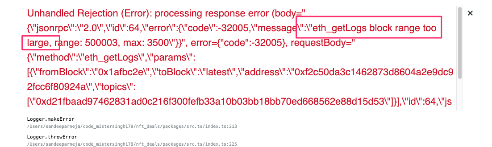

# faq

## contract doesn't have the expected methods, events etc. or has wrong functionality?
- maybe you have the wrong abi, addresses etc.
- `cp -r ../nft_deals/packages/react-app/src/contracts ./`

## make heroku only run the worker
- manually set it in heroku
- `heroku scale web=0 worker=1`

## see worker logs on heroku
- by specifying dyno I can filter them `heroku logs --dyno=worker --app=nft-deals-be --tail`
- `heroku logs --tail` will give them all

## run locally like on heroku
- heroku local web=0,worker=1
- this will load `.env` to get the variables, not required for us as we zsh loading it for us.
- `PORT=5002 npm start`
- `npm run getChainData`